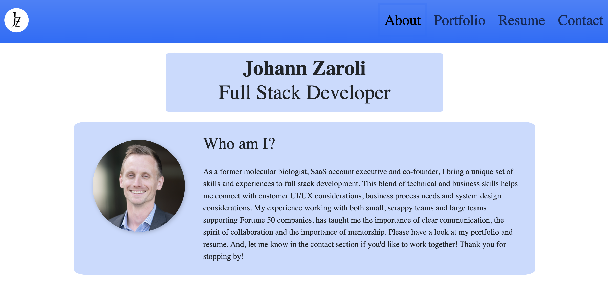
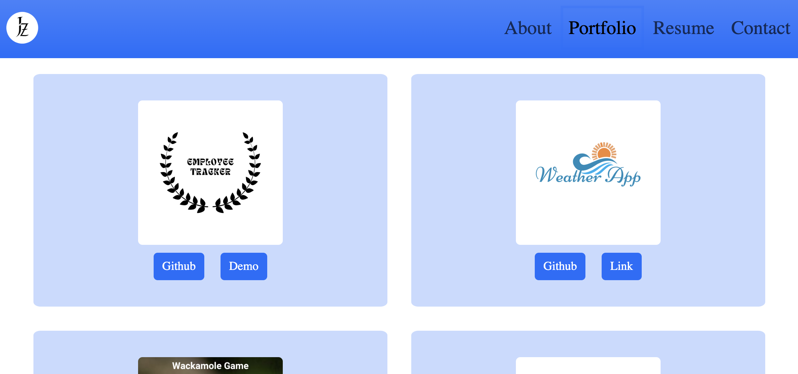

# Portfolio
## Description
This app is meant to be simple and straight forward; to share information about myself to prospective companies and business partners. It's built on React, Bootstrap and Formspree to simplify the contact form routing. The various logos and images were designed using Canva.

## Usage
The design is responsive. Still, I could see a number of improvements for improving usability; especailly on mobile. That being said, the current design works for all resolutions and doesn't need overengineering.

Screenshot 1:  
  

Screenshot 2:  
  

## Credits & How to Contribute
This app was created by Johann Zaroli. Please contact me on GitHub at Jzaroli with any questions or requests.

## License
MIT License

Copyright (c) <2024>

Permission is hereby granted, free of charge, to any person obtaining a copy of this software and associated documentation files (the "Software"), to deal in the Software without restriction, including without limitation the rights to use, copy, modify, merge, publish, distribute, sublicense, and/or sell copies of the Software, and to permit persons to whom the Software is furnished to do so, subject to the following conditions:

The above copyright notice and this permission notice shall be included in all copies or substantial portions of the Software.

THE SOFTWARE IS PROVIDED "AS IS", WITHOUT WARRANTY OF ANY KIND, EXPRESS OR IMPLIED, INCLUDING BUT NOT LIMITED TO THE WARRANTIES OF MERCHANTABILITY, FITNESS FOR A PARTICULAR PURPOSE AND NONINFRINGEMENT. IN NO EVENT SHALL THE AUTHORS OR COPYRIGHT HOLDERS BE LIABLE FOR ANY CLAIM, DAMAGES OR OTHER LIABILITY, WHETHER IN AN ACTION OF CONTRACT, TORT OR OTHERWISE, ARISING FROM, OUT OF OR IN CONNECTION WITH THE SOFTWARE OR THE USE OR OTHER DEALINGS IN THE SOFTWARE.